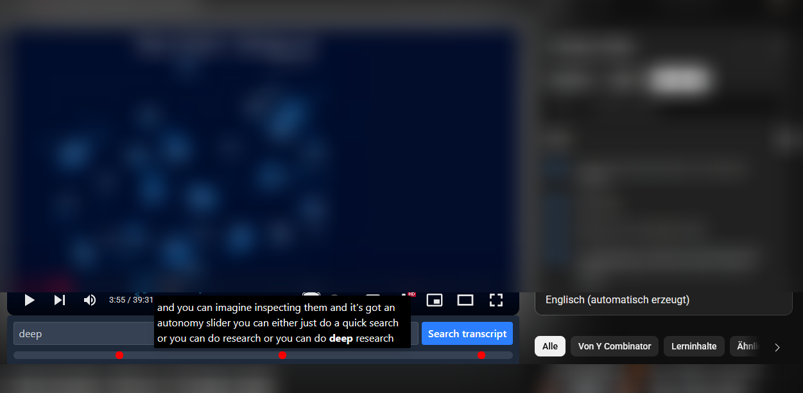

# YouTube Word Finder

Find the exact moment a word is spoken in a YouTube video.

This browser extension adds a search bar to the YouTube video page, allowing you to search for words in the video's transcript. The results are displayed with timestamps, and you can click on a result to jump to that specific moment in the video.

## Screenshot

## Installation

### Firefox

You can download the extension from the official Mozilla Add-ons store:
[https://addons.mozilla.org/firefox/addon/tubesearch/](https://addons.mozilla.org/firefox/addon/tubesearch/)

### Chrome

Coming soon!

## How it works

The extension fetches the video's subtitles and allows you to search through them. This is useful for long videos, podcasts, or educational content where you need to find a specific topic quickly.

## Contributing

Contributions are welcome! If you have ideas for new features or improvements, feel free to open an issue or submit a pull request.

## Built with

- [WXT](https://wxt.dev/)
- [Svelte 5](https://svelte-5-preview.vercel.app/)
- [TypeScript](https://www.typescriptlang.org/)
- [Tailwind 4](https://tailwindcss.com/blog/tailwindcss-v4-alpha)
